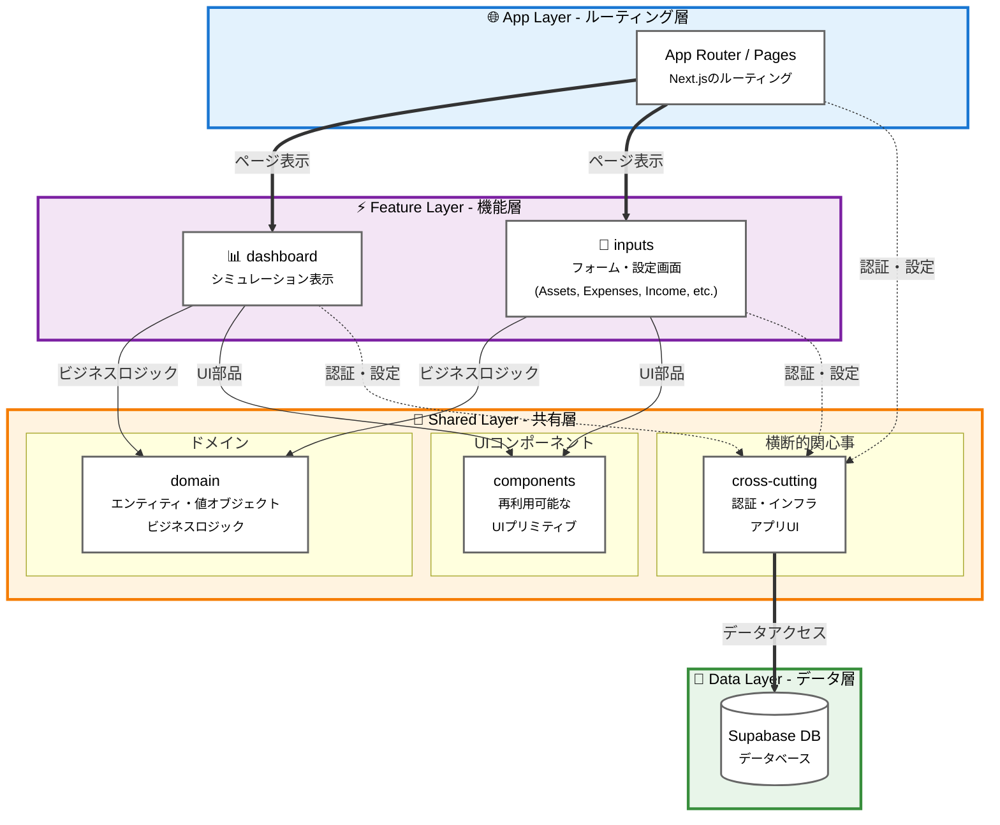
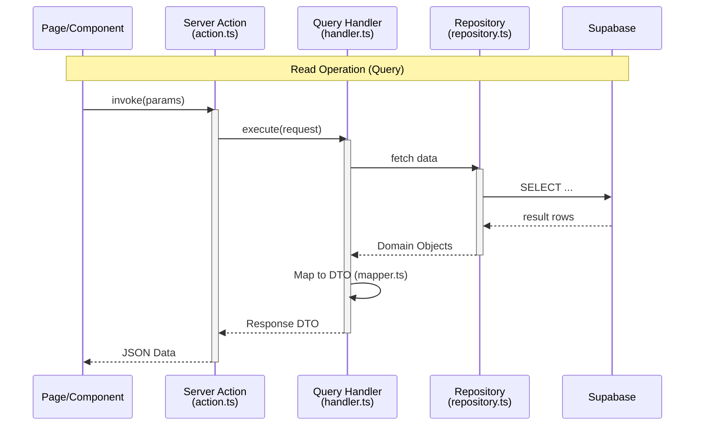
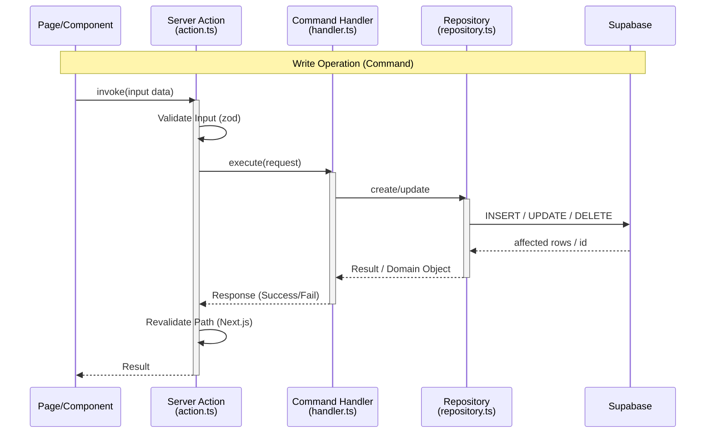
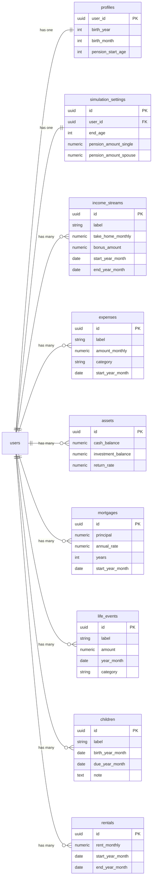

# Architecture Diagrams

## 1. パッケージ構造 (Vertical Slice Architecture)

この図は、垂直スライスアーキテクチャパターンに従ったコードベースの構成を示しています。

## 2. データフロー（CQRSパターン）

### 読み取り操作 (Query)

このシーケンス図は、読み取り操作（クエリ）におけるデータの流れを示しており、具体的には`get-dashboard-simulation`クエリをモデル化しています。機能内で使用されるRER（リクエスト-エンドポイント-レスポンス）パターンを実例で説明しています。

### 書き込み操作 (Command)

このシーケンス図は、書き込み操作（コマンド）におけるデータの流れを示しており、具体的には`create-asset`コマンドをモデル化しています。

## 3. データベーススキーマ（ER図）

この図は、Supabaseにおけるコアテーブルとその関係性を示しています。

