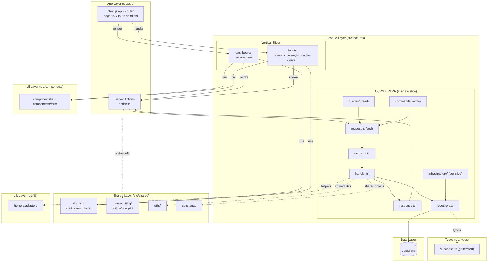
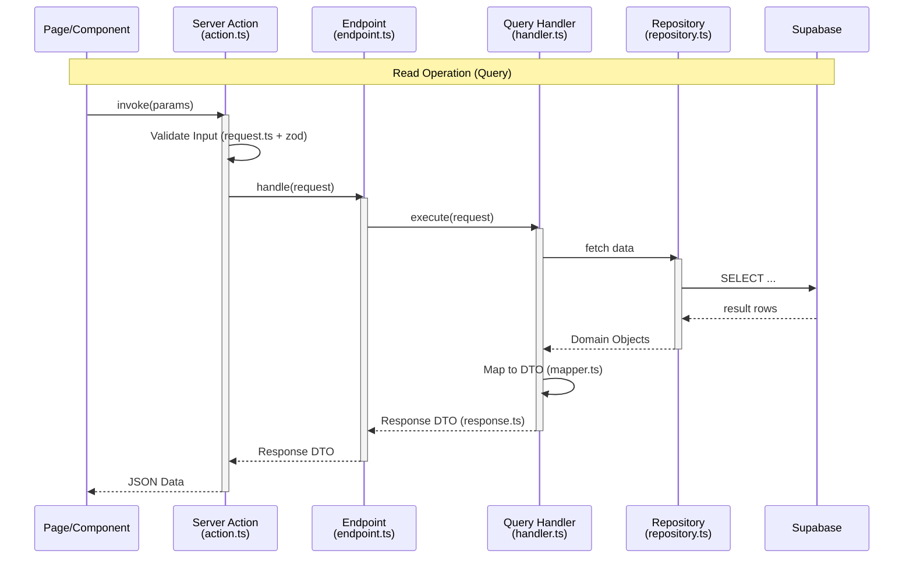
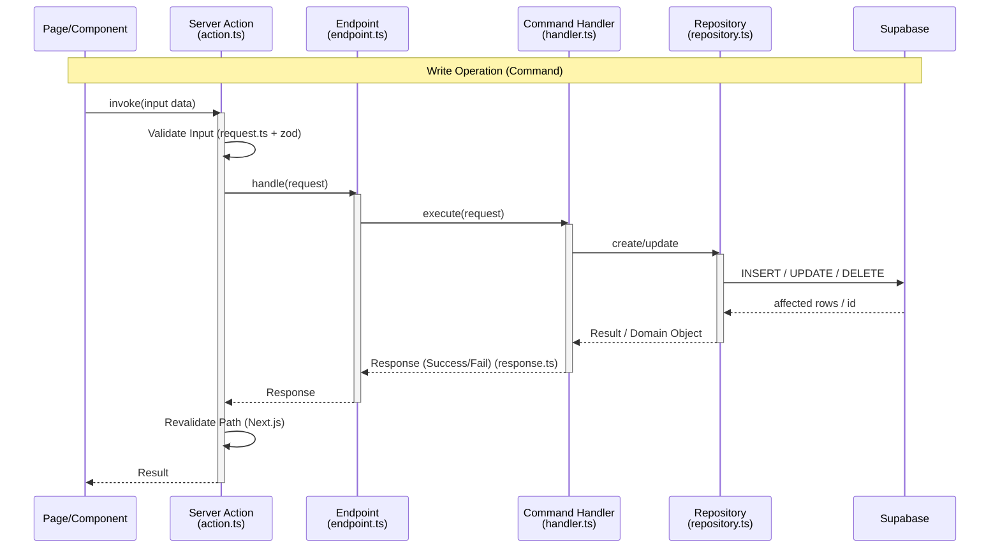

# Architecture Diagrams

## 1. パッケージ構造 (Vertical Slice Architecture)

## 2. データフロー（CQRSパターン）

### 読み取り操作 (Query)

このシーケンス図は、読み取り操作（クエリ）におけるデータの流れを示しており、具体的には`get-dashboard-simulation`クエリをモデル化しています。機能内で使用されるREPR（リクエスト-エンドポイント-レスポンス）パターンも含めて実例で説明しています。

### 書き込み操作 (Command)

このシーケンス図は、書き込み操作（コマンド）におけるデータの流れを示しており、具体的には`create-asset`コマンドをモデル化しています。

## 3. データベーススキーマ（ER図）

この図は、Supabaseにおけるコアテーブルとその関係性を示しています。`simulation_settings` はユーザーごとに複数行になり得るため、最新の`created_at`をアプリ側で採用しています。

```mermaid
erDiagram
    direction LR
    users ||--|| profiles : "has one"
    users ||--o{ simulation_settings : "has many (latest used)"
    users ||--o{ income_streams : "has many"
    users ||--o{ expenses : "has many"
    users ||--o{ assets : "has many"
    users ||--o{ mortgages : "has many"
    users ||--o{ life_events : "has many"
    users ||--o{ children : "has many"
    users ||--o{ rentals : "has many"

    profiles {
        uuid user_id PK
        int birth_year
        int birth_month
        int pension_start_age
    }

    simulation_settings {
        uuid id PK
        uuid user_id FK
        int end_age
        numeric pension_amount_single
        numeric pension_amount_spouse
    }

    income_streams {
        uuid id PK
        uuid user_id FK
        string label
        numeric take_home_monthly
        numeric bonus_amount
        date start_year_month
        date end_year_month
    }

    expenses {
        uuid id PK
        uuid user_id FK
        string label
        numeric amount_monthly
        string category
        date start_year_month
    }

    assets {
        uuid id PK
        uuid user_id FK
        numeric cash_balance
        numeric investment_balance
        numeric return_rate
    }

    mortgages {
        uuid id PK
        uuid user_id FK
        numeric principal
        numeric annual_rate
        int years
        date start_year_month
    }

    life_events {
        uuid id PK
        uuid user_id FK
        string label
        numeric amount
        date year_month
        string category
    }

    children {
        uuid id PK
        uuid user_id FK
        string label
        date birth_year_month
        date due_year_month
        text note
    }

    rentals {
        uuid id PK
        uuid user_id FK
        numeric rent_monthly
        date start_year_month
        date end_year_month
    }
```

