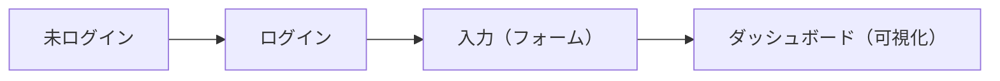
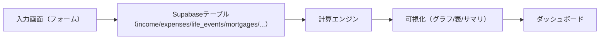
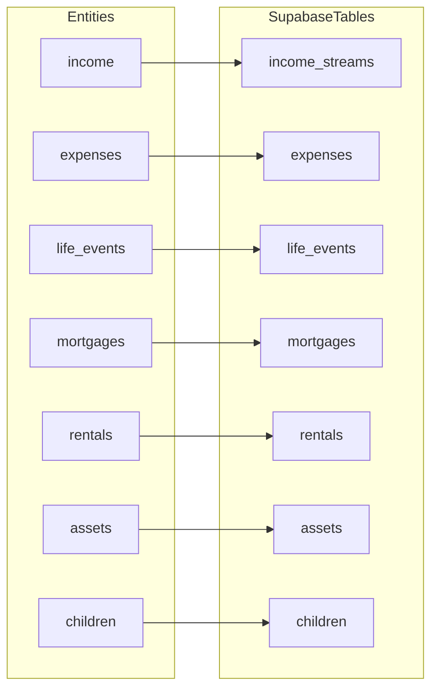

# Diagrams

## 画面遷移図（未ログイン→ログイン→入力→ダッシュボード）

```mermaid
flowchart LR
  Unauth[未ログイン]
  Login[ログイン]
  Inputs[入力（フォーム）]
  Dashboard[ダッシュボード（可視化）]

  Unauth --> Login --> Inputs --> Dashboard
```

## データフロー図（入力→計算エンジン→可視化）

```mermaid
flowchart LR
  InputUI[入力画面（フォーム）]
  Tables[Supabaseテーブル（income/expenses/life_events/mortgages/...）]
  Engine[計算エンジン]
  Visual[可視化（グラフ/表/サマリ）]
  Dashboard[ダッシュボード]

  InputUI --> Tables --> Engine --> Visual --> Dashboard
```

## 主要エンティティと Supabase テーブル対応図

```mermaid
flowchart LR
  subgraph Entities
    income[income]
    expenses[expenses]
    life_events[life_events]
    mortgages[mortgages]
    rentals[rentals]
    assets[assets]
    children[children]
  end

  subgraph SupabaseTables
    t_income[income_streams]
    t_expenses[expenses]
    t_life[life_events]
    t_mortgages[mortgages]
    t_rentals[rentals]
    t_assets[assets]
    t_children[children]
  end

  income --> t_income
  expenses --> t_expenses
  life_events --> t_life
  mortgages --> t_mortgages
  rentals --> t_rentals
  assets --> t_assets
  children --> t_children
```
