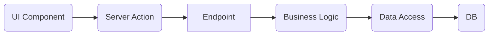

このドキュメントは、本リポジトリのアーキテクチャ、設計思想、開発フローを理解し、スムーズに開発に参加できるようにするためのオンボーディング資料です。

---

# Life Plan Simulator オンボーディングガイド

## 1. プロジェクト概要

本プロジェクトは、ユーザーの資産・収入・支出・ライフイベントなどの情報を元に、将来のキャッシュフローと資産推移をシミュレーションするアプリケーションです。

### 技術スタック
- **Frontend/Framework**: Next.js (App Router)
- **Language**: TypeScript
- **Styling**: Tailwind CSS, Shadcn/UI (Radix UI)
- **Backend/DB**: Supabase (Auth, PostgreSQL)
- **State Management**: React Server Components (RSC), Server Actions, React Hook Form
- **Testing**: Vitest (Unit/Integration), Playwright (E2E)

---

## 2. アーキテクチャと設計思想

本プロジェクトの最大の特徴は、機能ごとに垂直分割された **Feature Slices (機能別ディレクトリ構成)** と、明確な **レイヤー分離** です。

### 2.1 ディレクトリ構成の全体像

```text
src/
├── app/          # Next.js App Router (ルーティングとページのエントリポイント)
├── components/   # 汎用 UI コンポーネント (ボタン、フォームなど)
├── features/     # ★ メインロジック。機能ごとに分割 (assets, expenses, dashboard...)
├── shared/       # 全体で共有されるドメインロジックとインフラ
│   ├── domain/        # 純粋なビジネスロジック (Money, YearMonth, Simulation Engine)
│   └── cross-cutting/ # 横断的関心事 (Auth, Supabase Client)
├── lib/          # ユーティリティ (cn, zod-resolver)
└── types/        # Supabase 型定義 (自動生成)
```

### 2.2 Featureディレクトリの構造

`features/` 配下は、機能（ドメインモデル）ごとにディレクトリが切られています。
各機能ディレクトリ内は、**CQRS (Command Query Responsibility Segregation)** ライクに、更新系(commands)と参照系(queries)に分かれています。

例: `src/features/inputs/assets/`
```text
assets/
├── commands/         # 更新系処理
│   ├── create-asset/ # 資産作成ユースケース
│   ├── update-asset/ # 資産更新ユースケース
│   └── delete-asset/ # 資産削除ユースケース
├── queries/          # 参照系処理
│   └── list-assets/  # 資産一覧取得
└── ui/               # この機能固有のUIコンポーネント (Form等)
```

### 2.3 処理フローと責務 (Server Actions)

Server Actions を用いたバックエンド処理は、クラスベースでレイヤー分けされています。

1.  **Action (`action.ts`)**:
    *   Server Actionのエントリポイント。
    *   認証セッションの確立、DI (Dependency Injection) の構成、レスポンスの整形を行います。
2.  **Request Schema (`request.ts`)**:
    *   Zodによる入力バリデーション定義。
3.  **Endpoint (`endpoint.ts`)**:
    *   認証ユーザーIDの取得など、HTTP/セッション関連の処理を行い、Handlerを呼び出します。
4.  **Handler (`handler.ts`)**:
    *   **ビジネスロジックの中核**。
    *   ドメインオブジェクトの生成や計算を行い、Repositoryを呼び出します。
5.  **Repository (`repository.ts`)**:
    *   データアクセス層。Supabaseクライアントを操作し、DBの読み書きのみに専念します。

**データフロー図:**


---

## 3. 重要なドメイン概念 (`shared/domain`)

開発において頻出する、独自の Value Object (値オブジェクト) やロジックです。

### `YearMonth`
- **役割**: 「2024年4月」のような年月を扱います。
- **特徴**: シミュレーションは「月単位」で行われるため、Date型ではなくこのクラスを多用します。比較、加算、フォーマットなどのメソッドを持ちます。

### `Money`
- **役割**: 金額計算を扱います。
- **特徴**: 浮動小数点誤差を防ぎ、四捨五入や切り捨てのルールを統一しています。計算は必ずこのクラス経由で行ってください。

### Simulation Engine (`shared/domain/simulation`)
- **役割**: 入力データを受け取り、将来のキャッシュフローを計算するコアロジックです。
- **ファイル**: `simulate.ts` がメイン関数 `simulateLifePlan` を持ちます。
- **仕組み**: タイムライン（月ごとの配列）を生成し、収入・支出・イベントを適用して資産推移を算出します。

---

## 4. 開発ガイドライン

### 新しい入力項目を追加する場合

1.  **DB**: `src/types/supabase.ts` を確認（必要ならSupabase側でカラム追加し型生成）。
2.  **Domain/Repository**:
    *   `src/features/inputs/[機能名]/commands/` 下の Request Schema と Repository を修正。
    *   `src/features/inputs/[機能名]/ui/mapper.ts` でUI用データとAPI用データの変換を修正。
3.  **UI**:
    *   `src/features/inputs/[機能名]/ui/schema.ts` (Zod schema) を修正。
    *   `src/features/inputs/[機能名]/ui/[Form名].tsx` にフィールドを追加。
4.  **型の再生成 (必要な場合)**:
    *   Supabase側のスキーマを更新した場合は `pnpm supabase:gen-types` を実行。

### 新しい機能を追加する場合

1.  `features/[新機能名]` ディレクトリを作成。
2.  `commands`, `queries`, `ui` ディレクトリを切る。
3.  既存の構成（Action -> Endpoint -> Handler -> Repository）を模倣して実装する。
    *   *Tip*: コード量が多く見えますが、ボイラープレート（定型コード）に従うことで、テスト容易性と保守性が担保されています。

### UI実装の注意点
- **Server Components**: データのフェッチは `src/app/` 配下の `page.tsx` などで行い、Propsとして `src/features/**/ui` のコンポーネントに渡すのが基本パターンです。
- **Client Components**: フォームやインタラクティブな部分は `use client` を使用。
- **Shadcn/UI**: `src/components/ui/` にあるコンポーネントを使用してください。

---

## 5. 環境構築・起動

### 前提
- Node.js (LTS推奨)
- Supabase プロジェクト（ローカルまたはクラウド）

### 手順

1.  **依存関係のインストール**
    ```bash
    pnpm install
    # or
    npm install
    ```

2.  **環境変数の設定**
    `.env.local` ファイルを作成し、以下を設定してください。
    ```env
    NEXT_PUBLIC_SUPABASE_URL=your_supabase_url
    NEXT_PUBLIC_SUPABASE_PUBLISHABLE_KEY=your_supabase_anon_key
    SUPABASE_SECRET_KEY=your_supabase_service_role_key
    SUPABASE_PROJECT_ID=your_supabase_project_id
    ```

3.  **開発サーバー起動**
    ```bash
    pnpm dev
    # or
    npm run dev
    ```

---

## 6. 特記事項・Tips

*   **グラフ描画**: `AssetTrendChart.tsx` はライブラリを使わず、SVGを直接操作して描画しています。軽量化のためです。
*   **認証**: `shared/cross-cutting/auth` にまとまっています。Supabase Auth をラップしており、`useAuth` フックや `RequireAuth` コンポーネントで制御します。
*   **E2Eテスト**: `src/app/e2e/` にシードデータ作成用のエンドポイントがあり、テスト環境のセットアップに使用されています。

---

以上が概要です。まずは `src/app/(app)/inputs/page.tsx` を起点に、各入力フォームがどのようにデータを取得・表示しているかを追ってみることをお勧めします。
